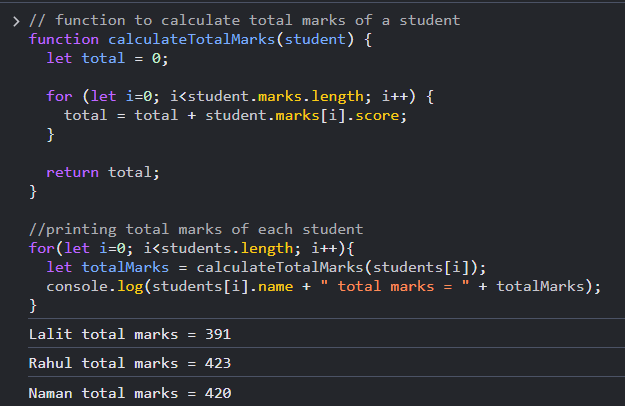
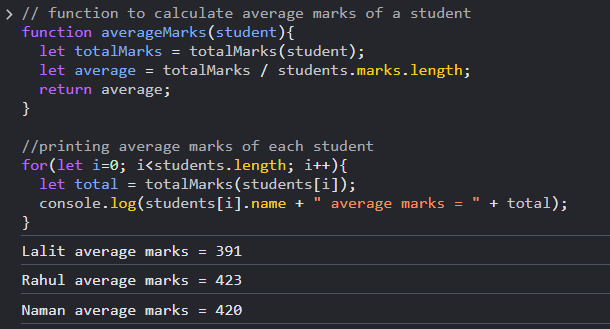
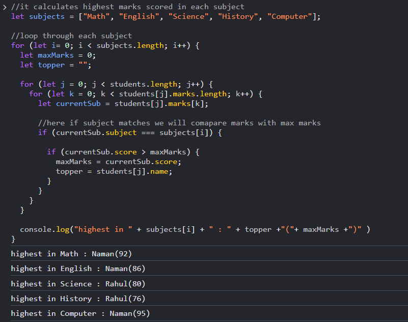
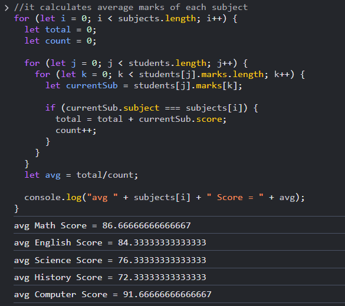
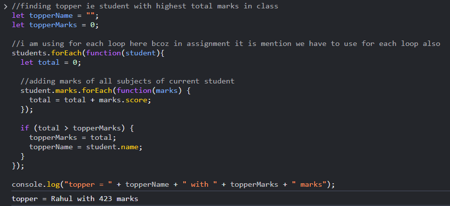
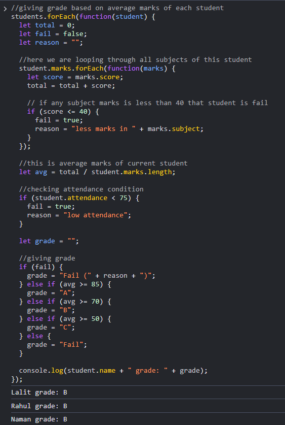

# Assignment - Student Performance Analyzer

## Program Output Screenshots and Explanation

## 1. Added Student Data

### Explanation :
- I created an array of students conatining 3 students data.
- Each student object has name, marks array and attendence
- This data is used for all calculations in this program.

## 2. Total marks calculation

### Explanation :
- I created a function totalMarks(student) that calculates the total marks of a student.
- Inside that, I used a loop to go through all the subjects and added each subject score to a total variable
- The function then returns the total marks of that student.
- At last, I used a loop to call this function for every student and printed their total marks in the console.

## 3. Average marks calculation

### Explanation :
- I created a function averageMarks(student) to calculate the average marks of a student.
- Inside this function, I first called the totalMarks() function to get the total marks.
- then divided total marks with number of subject to get the average and prints each student average in console

## 4. Subject wise highest marks

### Explanation :
- I made a list of subjects and loop through it using 1st loop
- 2nd loop : checks all students
- 3rd loop : checks subjects of each student 
- For each subject, I compared marks of all students and update the highest marks.
- At last, i print the highest marks for each subject

## 5. Subject wise average marks

### Explanation :
- 1st loop : goes through each subject one by one.
- 2nd loop : goes through all students.
- 3rd loop : checks marks of each student for that subject.
- Then I calculated the average by dividing total marks by count.
- Finally, I printed the average marks for each subject

## 6. Finding topper

### Explanation :
- In this, for every student, i calculated total marks by adding scores of all subjects.
- Then i compare and update the topperMarks and name variable
- Finally, i printed the topper with their total marks.

## 7. Giving grades

### Explanation :
- I used forEach loop to go through each student and their marks.
- Then i calculated total marks and checked fail conditions (ie marks ≤ 40 or attendance < 75).
- Then I calculated the average marks.
- At last, based on the average marks, i assigned grades to them.

  
