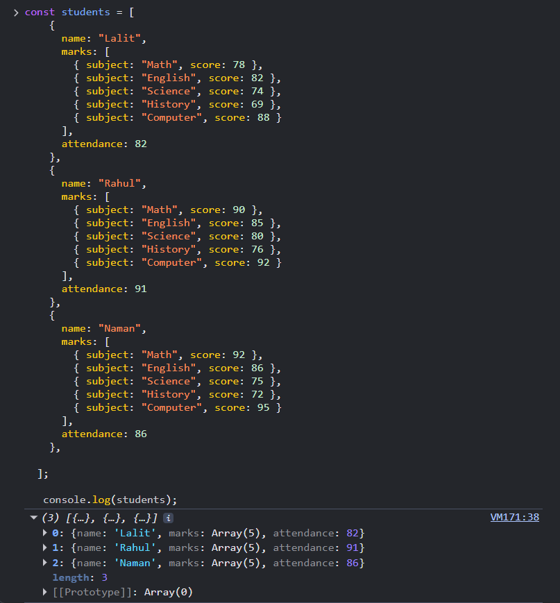

# Assignment - Student Performance Analyzer

## Program Output Screenshots and Explanation

## 1. Added Student Data

### Explanation :
- I created an array of students conatining 3 students data.
- Each student object has name, marks array and attendence
- This data is used for all calculations in this program.

  
