# Mini Project - Product Inventory Dashboard 
 
## Projects Screenshots and Explanation

This project is a simple Product Inventory Dashboard where we can add, view, filter, and manage products easily.

## 1. Full Dashboard

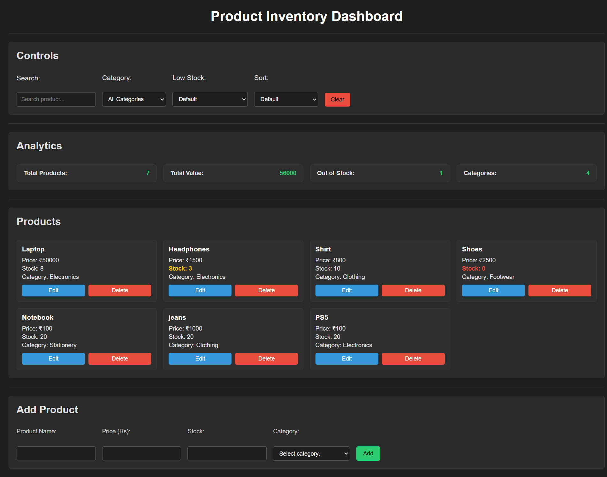

### Explanation:
- This is the complete view of the dashboard.
- It contains all sections like controls, analytics, product list, and add product form.
- It gives a clear overview of how the whole system works together.
- Users can manage products easily from one place.

## 3. Header and Control Section

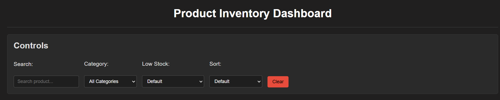

### Explanation :
- header shows the title of the application.
- Below it, I created a control section to manage products.
- It includes search, category filter, low stock filter, and sorting options.
- there is also a Clear button to reset all filters.

 ### Search Functioanlity

 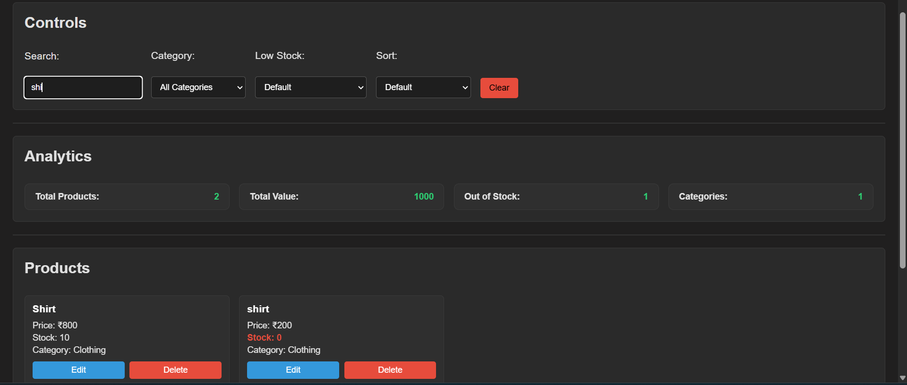

 - I added a search bar to find products by name.

 ### Category Filter

 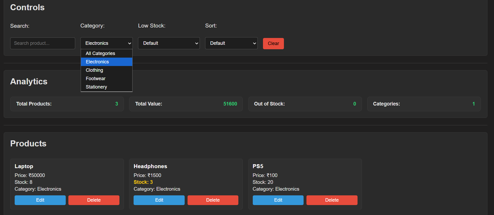

 - This dropdown allows filtering products by category.

 ### Low Stock Filter

 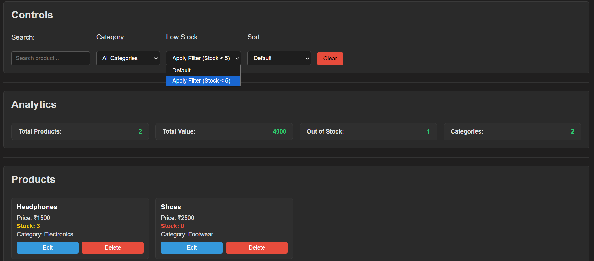

 - This filter shows products with stock less than 5.

 ### Sorting Filter

 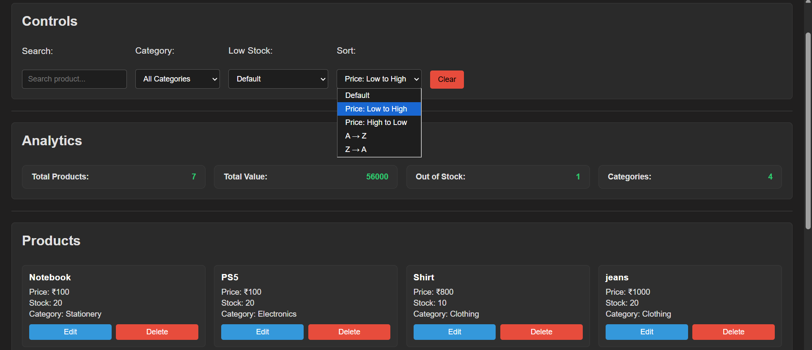

 - I added sorting options so that product can be sorted based on prize and alphabetical order

## 3. Analytics Section

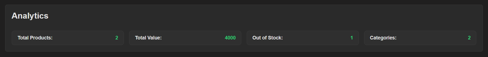

### Explanation :
It displays:
- Total number of products
- Total value of all products
- Number of out of stock items
- Total categories

## 4. Product Section

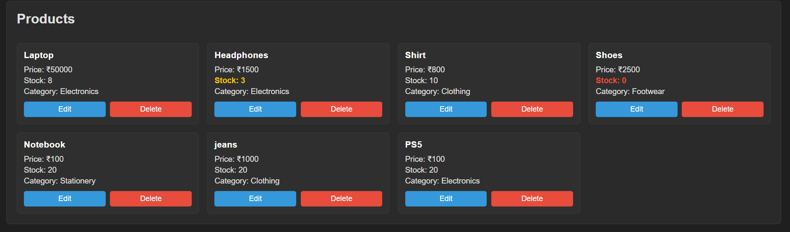

### Explanation :
- This section displays all products in card format.
- Each card shows name, price, stock, and category
- Stock status is highlighted using colors:
   - Yellow for low stock
   - Red for out of stock

 ### Edit and Delete Feature

 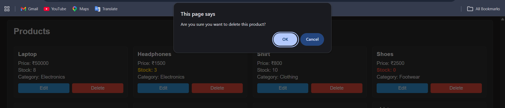

 - Edit changes the product data with new data.
 - Delete removes the product after confirmation.

## 5. Add Product Form

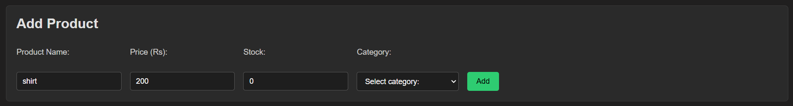

### Explanation :
- I created a form to add new products.
- It takes input like name, price, stock, and category.
- when user click add button it gets added to list

## 6.Responsive Design

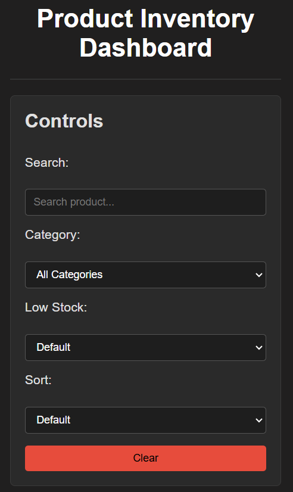
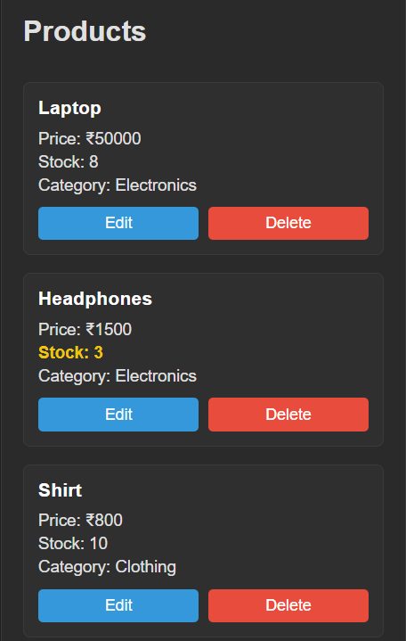

The layout is responsive for different screen sizes.
