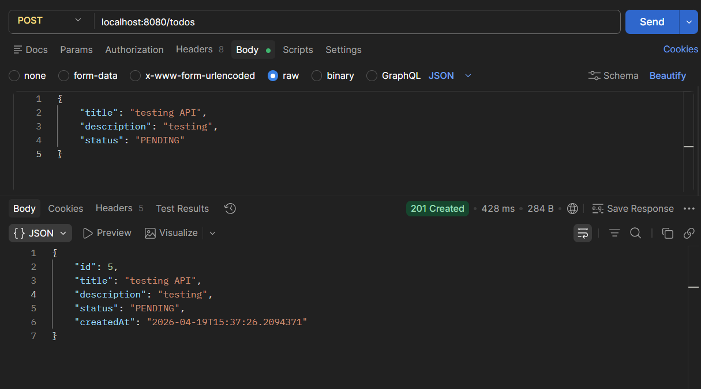
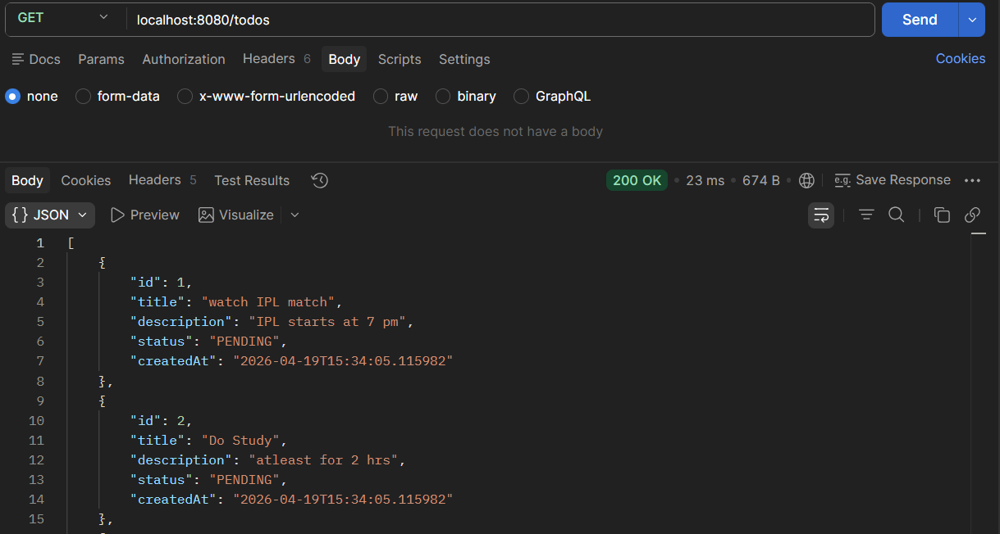
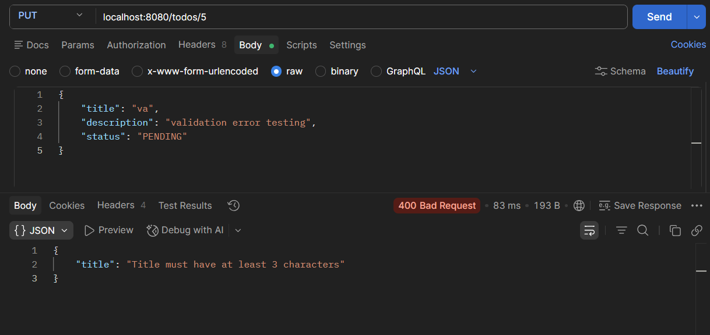
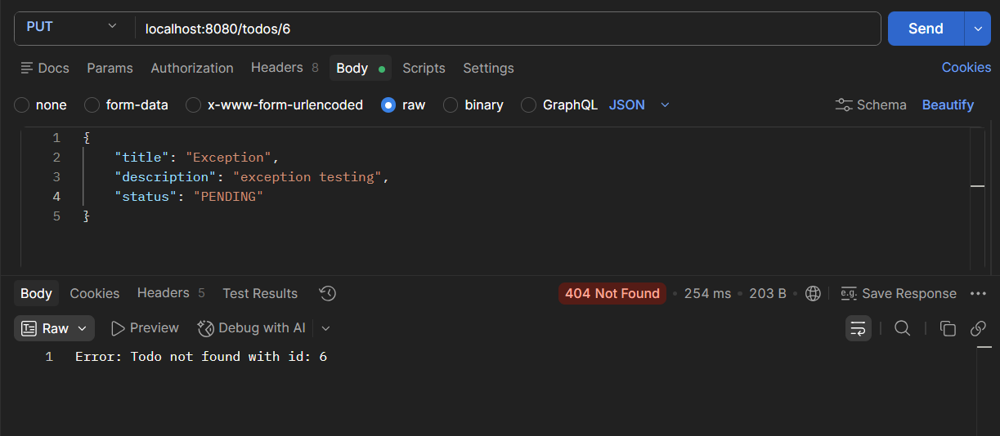

# Todo App (Spring Boot Advance Assignment)

A Spring Boot REST API for managing Todo tasks.  
It demonstrates concepts such as layered architecture, DTO separation, validation, global exception handling, logging, and unit testing.

The application follows a structured layered architecture:

#### Client → Controller → Service → Repository → DB

---

## Tech Stack
| Category   | Technology Used             |
|-----------|-----------------------------|
| Language  | Java 17                     |
| Framework | Spring Boot                 |
| ORM       | Spring Data JPA + Hibernate |
| Database  | H2 Database                 |
| Validation| Jakarta Validation          |
| Build Tool| Maven                       |
| Testing   | JUnit + Mockito             |
| Logging   | SLF4J + Logback             |

---

## Project Structure
````
src/main/java/com.naman.todo
│
├── controller
│ └── TodoController.java              # Handles API requests
│
├── service
│ ├── TodoService.java                 # Contains business logic
│ └── NotificationServiceClient.java   # Notification service
│
├── repository
│ └── TodoRepository.java              # Handles database operations
│
├── entity
│ └── Todo.java                        # Todo entity class
│
├── dto
│ ├── TodoRequestDTO.java              # Request DTO
│ └── TodoResponseDTO.java             # Response DTO
│
├── exception
│ ├── TodoNotFoundException.java       # Custom exception
│ ├── InvalidStatusException.java      # Custom exception
│ └── GlobalExceptionHandler.java      # Global exception handler
│
├── enums
│  └── TodoStatus.java                 # Enum for status
│
└── SpringAdvanceAssignmentApplication.java


src/test/java/com.naman.todo
│
└── service
      └── TodoServiceTest.java               # Contains Test Cases

````

---

## Features
- Perform CRUD operations (Create, Read, Update, Delete) on todos
- DTO separation for request and response handling
- Input validation using `@Valid`
- Global exception handling using `@RestControllerAdvice`
- Status transition validation (PENDING ↔ COMPLETED)
- Unit testing using Mockito & JUnit
- Logging using SLF4J and Logback
- Clean, scalable and layered architecture

---

## API Endpoints

#### Base URL: `http://localhost:8080/todos`


| Method | Path           | Description               | Success Status |
|--------|---------------|---------------------------|----------------|
| POST   | /todos        | Create a new Todo         | 201 Created    |
| GET    | /todos        | Retrieve all Todos        | 200 OK         |
| GET    | /todos/{id}   | Retrieve a Todo by ID     | 200 OK         |
| PUT    | /todos/{id}   | Update a Todo by ID       | 200 OK         |
| DELETE | /todos/{id}   | Delete a Todo by ID       | 200 OK         |


### 1. Create Todo
**POST** `/todos`

#### Request Body :
```
{
  "title": "Go to market",
  "description": "bring vegetable in evening",
  "status": "PENDING"
}
```

#### Response :
```
{
"id": 1,
"title": "Go to market",
"description": "bring vegetable in evening",
"status": "PENDING",
"createdAt": "2026-04-18T21:30:00"
}
```

### 2. Get All Todo
**GET** `/todos`

#### Response :
```
[
  {
    "id": 1,
    "title": "Go to market",
    "description": "bring vegetable in evening",
    "status": "PENDING",
    "createdAt": "2026-04-18T21:30:00"
  }
]
```

### 3. Get Todo by ID
**GET** `/todos/{id}`  

#### Example : `GET /todos/1`

#### Response :
```
{
  "id": 1,
  "title": "Go to market",
  "description": "bring vegetable in evening",
  "status": "PENDING",
  "createdAt": "2026-04-18T21:30:00"
}
```

### 4. Update Todo
**PUT** `/todos/{id}`  

#### Example : `PUT /todos/1`

#### Request Body :
```
{
  "title": "Updated Title",
  "description": "Updated Description",
  "status": "COMPLETED"
}
```
#### Response:
```
{
"id": 1,
"title": "Updated Title",
"description": "Updated Description",
"status": "COMPLETED",
"createdAt": "2026-04-18T21:30:00"
}
```

---

### 5. Delete Todo
**DELETE** `/todos/{id}`

#### Example : `DELETE /todos/1`

#### Response :
```
Todo deleted successfully
```
---

##  Example Screenshots

#### 1. API Response : 

- create Todo


  
- Get all todos
  

     
#### 2. Validation Error :
  


#### 3. Exception Handling :



---

##  Validation Rules

| Field       | Rule                                     |
|------------|------------------------------------------|
| title       | Not null & minimum 3 characters required |
| description | Optional                                 |
| status      | Must be PENDING or COMPLETED             |

---

##  Key Concepts Implemented
- DTO Pattern (Request vs Response)
- Layered Architecture (Controller → Service → Repository)
- Exception Handling using `@RestControllerAdvice`
- Input Validation with Jakarta Validation
- Enum-based status management
- Logging using SLF4J
- Unit Testing using JUnit and Mockito

---

## Test Coverage

| Method        | Test Case Implemented        |
|--------------|-----------------------------|
| createTodo    | Create Todo Success         |
| getTodoById   | Get Todo by ID (Success)    |
| getTodoById   | Todo Not Found Exception    |
| getAllTodos   | Fetch All Todos             |
| updateTodo    | Update Todo Success         |
| deleteTodo    | Delete Todo                 |


---
##  How to Run

1. Clone the repository
 ````
   git clone <your-repo-url>
````
2. Navigate to project folder
 ````
   cd spring-advance-assignment
````
3. Run the application
 ````
   mvn spring-boot:run
````
4. Access API
 ````
   http://localhost:8080/todos
````

---

## Developed By 
Naman Patel

---

## Notes  
- Uses H2 in-memory database
- Data resets on application restart