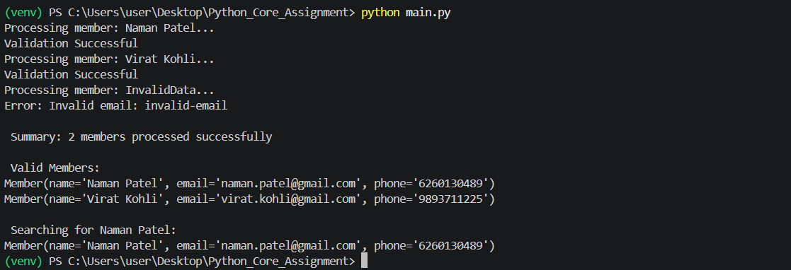
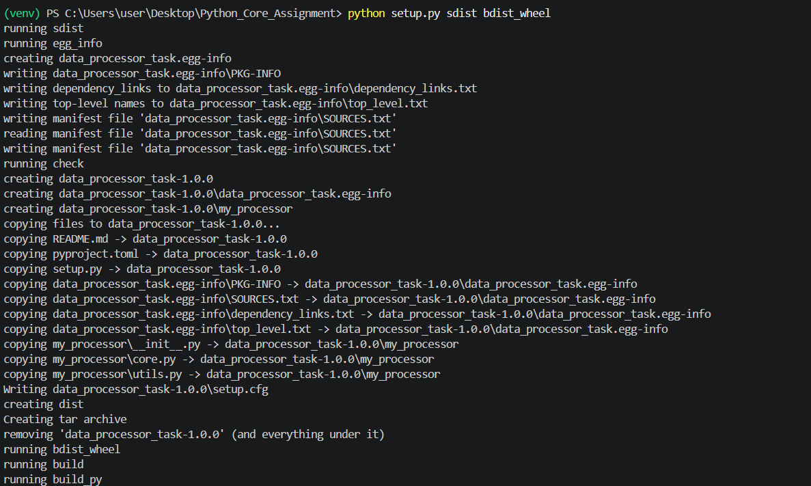
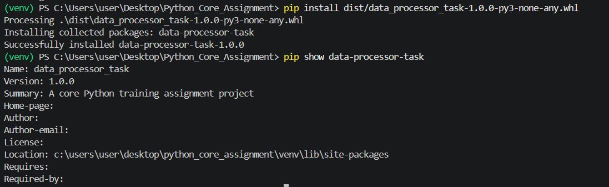
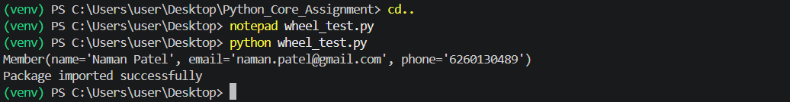
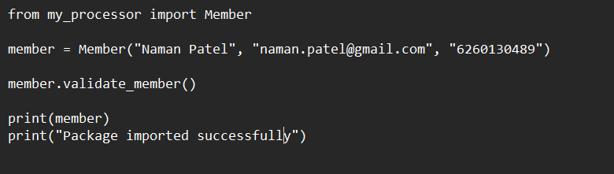

# Data Processor Task

A Python training assignment demonstrating core Python concepts

## Features


- Dictionaries and Lists
- Python Functions
- Python Modules
- Object-Oriented Programming
- Custom Exception Handling
- Lambda and filter()
- Regular Expressions
- Python Package Creation

## Package

Package name: data_processor_task

Version: 1.0.0

## Usage

```python
from my_processor import Member

member = Member("Naman Patel", "naman.patel@gmail.com", "6260130489")

member.validate_member()

print(member)
```

<br>

## Screenshots

### 1. Main Program Execution



<br>

### 2. Wheel File Creation



<br>

### 3. Wheel Installation and Verification



<br>

### 4. Wheel Package Import Test



<br>

#### Wheel Test Code (wheel_test.py)

